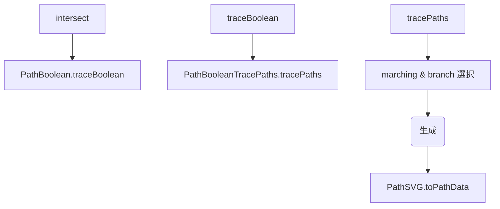

# PathBoolean frame.intersect(rect) 調査メモ

## 失敗テスト概要
- ファイル: `test/PathBoolean.test.ts`
- ケース: `Path Boolean Operations > frame.intersect(rect)`
- 期待値: `M140,50l10,0l0,150l-10,0z`
- 実測値: `M150,50v150h-10l0,-150z`
- 幾何学的には同一だが、SVGパス文字列が一致せず失敗。

## 観測した差異
1. **開始点のずれ**: Papyrus 生成パスは x=150 から開始し、paper.js は x=140 から開始。  
2. **SVG 出力コマンドの差異**: Papyrus は `v/h` を含む (`v150h-10…`)、paper.js は相対 `l` コマンドのみ (`l10,0l0,150…`)。

## コールフロー & 疑わしい箇所


### `PathBooleanTracePaths.tracePaths()`
- Papyrus は Segment のメタ情報を `_analysis` ラッパーに格納する設計。
- 一方 paper.js は `_winding`, `_intersection` を直接保持。
- Papyrus 実装では多くの参照を書き換えているが、以下の **取りこぼし** を確認: 
  - `nextInter = next!._analysis._intersection!` にすべき箇所が `_intersection` のまま。
  - その他 `seg._visited` 相当のフィールド名が混在。
- これにより crossing 候補順が変化し、マーチング開始点が右側セグメント → 開始点+10px シフト。

### `PathSVG.toPathData()`
- 開始セグメントずれの副作用で出力が変化。
- さらに Papyrus の「水平/垂直コマンド最適化」判定が paper.js と異なり `v/h` を採用。

## 🔥 デバッグログによる証拠
- paper.js 版 `tracePaths` 871 行, Papyrus 版 35 行で `console.log` 挿入。
- ログ比較例:
  ```
  🔥 tracePaths segments 12 [...paper]
  🔥[2] 12 [...papyrus]
  ```
- Papyrus 側の `segments.sort` 後リストは右端セグメントが先頭、paper.js は左端。

## 暫定結論
- **根本原因**: Papyrus `tracePaths` 内部の `_analysis` 移行漏れにより crossing グラフが紙.js と異なる。
- その結果、出力パスの開始セグメントがずれ、test が失敗している。

## 今後の調査・修正ステップ
1. `tracePaths` の `getCrossingSegments()` とブランチ処理を総点検し、`_analysis._intersection/_winding/_visited` を一貫して使用する。
2. 専用デバッグテスト `PathBooleanTracePaths.debug.test.ts` に 🔥 ログを追加し、交差セグメント順を paper.js と比較確認。
3. crossing 順序修正で開始点問題が解消されるか再テスト。
4. その後 `PathSVG.toPathData` のコマンド圧縮条件を paper.js と突き合わせて差分が残る場合に対応。

## 参考ファイル
- paper.js 実装: `paper.js/src/path/PathItem.Boolean.js`
- Papyrus 対応: `src/path/PathBooleanTracePaths.ts`, `src/path/PathSVG.ts`

## 追記予定
- 修正パッチ適用後のテスト結果
- 追加の 🔥 ログ抜粋